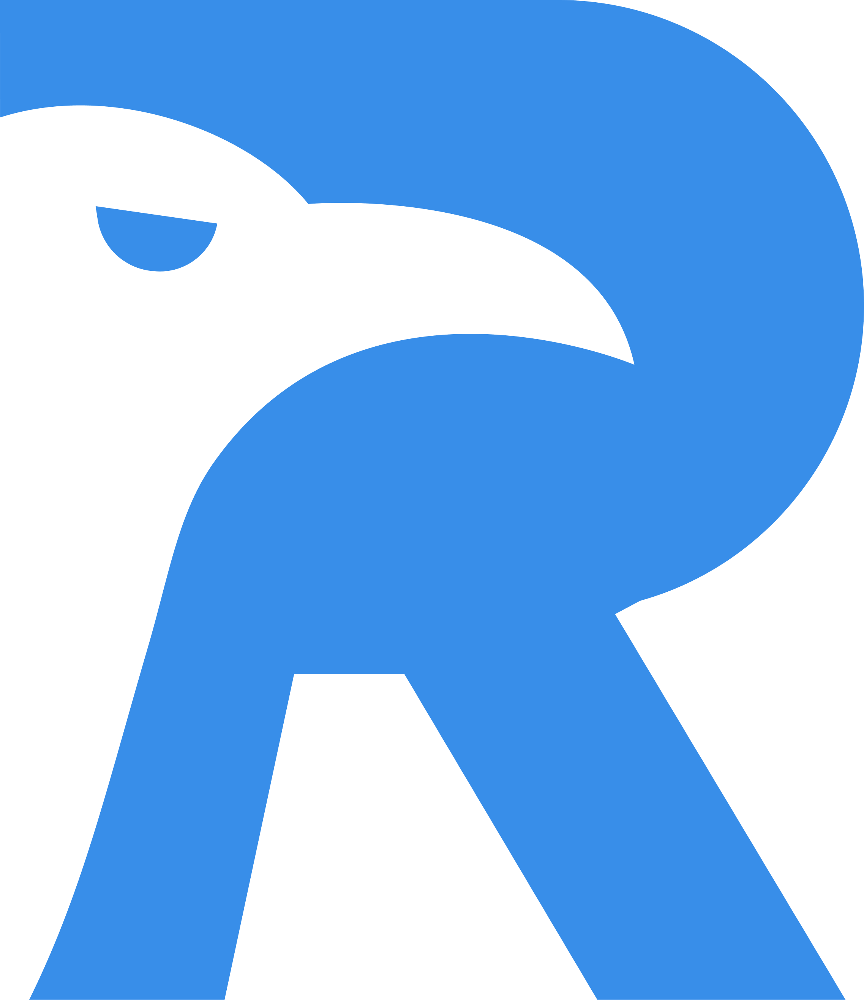
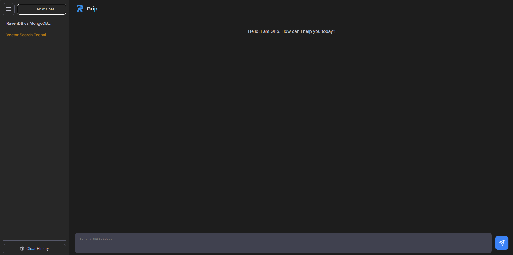
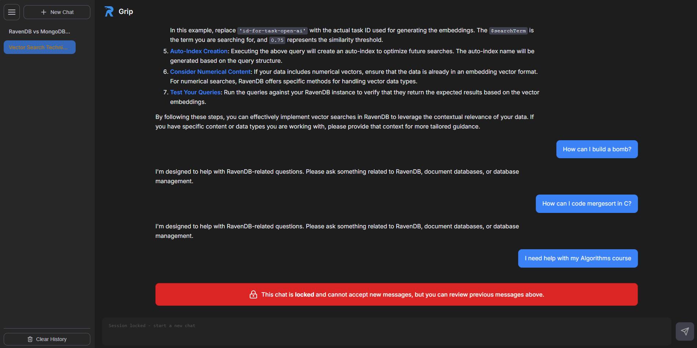
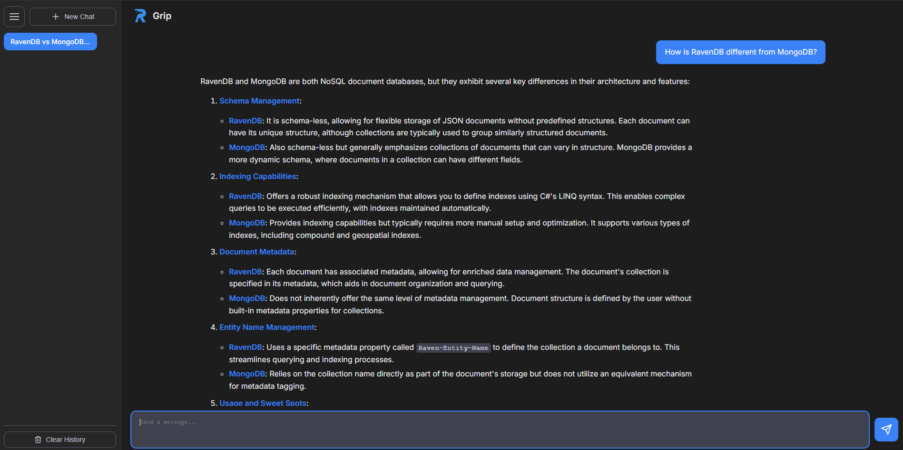
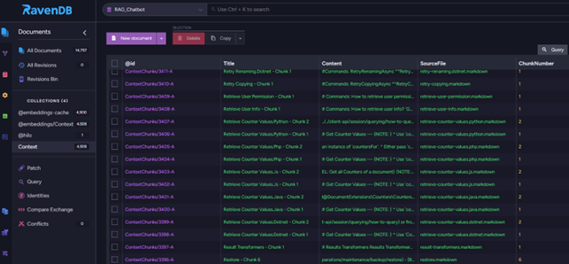

1# 🧠 Grip: A RAG-Based Chatbot for RavenDB



**Grip** is a secure and professional Retrieval-Augmented Generation (RAG) chatbot designed to assist users with RavenDB usage, including querying, indexing, security, and configuration. It is hosted locally using Flask and powered by OpenAI’s `gpt-4o-mini`. Contextual information is retrieved live from a RavenDB database.

> ⚠️ **Note:** You must provide your own OpenAI API key to use this project. Insert it into the `app.py` file.

---

## 🖥️ Interface Preview



---

## ⚙️ Features

- 🔍 **RAG-enabled Support**: All user queries are enhanced semantically and matched against pre-chunked Markdown content stored in RavenDB.
- 🔐 **Session Locking**: Repeated off-topic prompts (3 in a row) will lock the chat session.
- 🧾 **Conversation Memory**: Session history is summarized automatically to preserve context while reducing token usage.
- 🧠 **Legal Query Filter**: Only questions related to RavenDB are accepted.
- 💾 **Fully Local Execution**: All data, vector search, and session management are handled using RavenDB without third-party cloud storage.
- ✨ **Responsive UI**: Clean dark-mode interface with collapsible sidebar and multi-session navigation.

---

## 🛠️ Architecture Overview

### 🔹 Backend: `Python + Flask + RavenDB + OpenAI`

```text
User Input
   │
   ▼
[Flask Server (app.py)]
   ├── Validates query relevance
   ├── Enhances for semantic search
   ├── Retrieves context from RavenDB vector store
   ├── Generates title/summaries via OpenAI
   └── Responds with context-aware LLM output
```

- **Database**: RavenDB stores vectorized content chunks and full session history.
- **LLM Provider**: OpenAI's GPT-4o-mini is used through API.
- **Session Control**: Illegal queries increment a counter; after 3 invalid messages, session is locked.

### 🔹 Frontend: `HTML + JS + CSS`

- Sidebar for chat sessions
- Markdown-formatted bot responses
- Session locking notification  
  

- User interaction with typing animation  
  

---

## 🧩 Chunking Pipeline

The `rag_chunker_script.py` tool is used to pre-process Markdown files:

- Removes front-matter metadata
- Splits text into overlapping chunks (3000 characters, 450 overlap)
- Stores them as `ContextChunk` documents in RavenDB under `Context` collection

RavenDB sample view:  


---

## 🚀 Getting Started

### Prerequisites

- Python 3.10+
- RavenDB running locally (`http://localhost:8080`)
- An OpenAI API key

### Installation

```bash
# 1. Clone the repo
git clone https://github.com/yourusername/grip-chatbot.git
cd grip-chatbot

# 2. Install dependencies
pip install flask flask-cors openai pyravendb python-frontmatter

# 3. Add your OpenAI API key to `app.py`
OPENAI_API_KEY = "your-key-here"

# 4. Restore the RavenDB database (if a dump file is provided)
# You can do this using RavenDB Studio > Manage Server > Import Database.

# 5. Run the chunking script to add your markdown docs
python rag_chunker_script.py

# 6. Launch the app
python app.py
```

Then open `http://127.0.0.1:5001` in your browser.

---

## 📁 Project Structure

```text
├── app.py                  # Flask backend (core logic)
├── index.html              # Main chat UI
├── script.js               # Client-side session/message handling
├── style.css               # Visual design & responsiveness
├── rag_chunker_script.py   # Preprocessing script to chunk & upload docs
├── images/
│   └── logo.png
```

---

## 🧠 Legal Query Definition

The assistant will only respond to:

- Questions about RavenDB
- General database-related questions (Will assume it's about RavenDB)
- Comparisons to other DBs

Any other topics will be rejected. After 3 consecutive illegal prompts, the session is locked.

---

## 📛 Why "Grip"?

> The assistant is named **Grip** after the famous talking raven from Charles Dickens, who inspired Edgar Allan Poe’s “The Raven”. Since RavenDB uses a raven in its branding, the name reflects both literary heritage and technical purpose.

---
